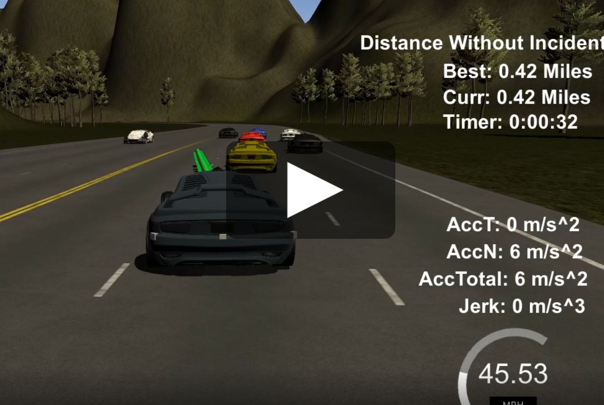
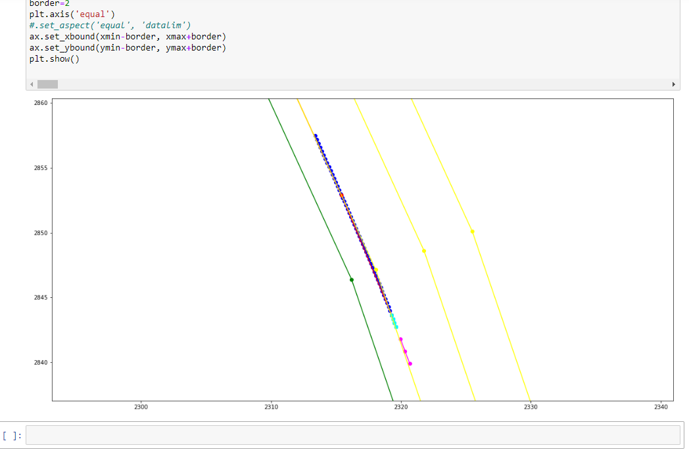

# CarND-Path-Planning-Project
Self-Driving Car Engineer Nanodegree Program
   
### Goals
In this project your goal is to safely navigate around a virtual highway with other traffic that is driving +-10 MPH of the 50 MPH speed limit. You will be provided the car's localization and sensor fusion data, there is also a sparse map list of waypoints around the highway. The car should try to go as close as possible to the 50 MPH speed limit, which means passing slower traffic when possible, note that other cars will try to change lanes too. The car should avoid hitting other cars at all cost as well as driving inside of the marked road lanes at all times, unless going from one lane to another. The car should be able to make one complete loop around the 6946m highway. Since the car is trying to go 50 MPH, it should take a little over 5 minutes to complete 1 loop. Also the car should not experience total acceleration over 10 m/s^2 and jerk that is greater than 10 m/s^3.

### Results
Here's a short gif about a random lane change.


I've measured the distance over 30 minutes to see the performance of the algorithm. With conservative paramters (only changing lane when there was a significant advantage), the [result](30min.png) was 20.71 miles.
After tweaking with lane score weights, the 30 minutes performance improved to 24.52 miles:


Here's a recorded lap on Youtube:

[](https://www.youtube.com/watch?v=dkDTlqoc6KE)

### Overview

The trajectory is recalculated in every frame. A few points is kept from the previous trajectory to maintain continuity, the rest is discarded.
While this causes a lot of trouble with Spline or JMT, the ego vehicle has a much better response time, and it's more realistic.
The safety and following distances are very low to showcase this behavior.

The Frenet transformation is not linar. When the road curves left, cars in the right lane have to travel more distance.
The default implementation overcomes this issue by jumping through the gap, so the "s" function is not continuous.
I've implemented a different approach, where the Frenet coordinate system is centered on the ego vehicle, and the "s" coordinate is continuous, but it's not precise for far objects.

For trajectory generation, I use the spline library. Only 3 points are used from the previous trajectory, expanded backwards lineraly for 3 meters to make it smoother. Forward direction I add points which are on the target lane centerline.

The speed is controlled by surrounding cars of the environmental model, referenced as "sensor fusion". The trajectory planner receives a target speed and a time to reach that speed.

Lane change is determined by a scoring function, it's based on closest car distance, lane distance, and speed of traffic.
Some lanes may be blocked by cars, even fast approaching ones or slow cars ahead.

### Trajectory Calculation Steps

The entry point is in the main::onMessage function. The ego car properties are calculated from the previous trajectory, because our starting point is at the 4th point.
This is the minimum number to calculate the jerk value, which is the change in acceleration.
One point gives position, two velocity, acceleration from three, and 4th is needed to check jerk.
Acceleration value is used for continuous braking. Jerk would be useful for jerk control, but it's not used.

Ego vehicle and sensor fusion data is matched to the lane centerlines of the map to find their lane, and recalculate the Frenet coordinates with the more precise system.
Speed vector is projected to the waypoint segment with `map.project_speed` to get the `vs` and `vd` values in Frenet.

`LaneChangePlanner` calculates a single `target_lane`, which is always adjacent to the current lane.

Next, I check for the closest car ahead, and also the closest car in the target lane.
This is usually the same car, because even during lane change, the car in the target lane would overlap in `d` axis with the ego vehicle, but it's important when starting lane change to follow a slower car.

The `delta_t0` here is the timestamp of the end of our used previous trajectory, so the trajectory calculation starts at this timestamp in the near future.
Except for startup, it's 0.08, which is also the minimum reaction time of the system.

`LimitSpeed` is called for the car we're following, or both, if there're 2 of them. Based on the distance and speed difference, a target speed and target time is calculated.

`SpeedController` is for handling a simple speed profile. A target speed is reached at a target time, linearly changing speed over time, and that speed is maintained after that.
It's set up with the `LimitSpeed` output and used by `TrajectoryBuilder`.

The output of `TrajectoryBuilder` is the refined trajectory, which has control points in 0.02 second intervals. This is the output of our calculations.

#### Helper functions

`Point` is just for storing coordinates, and some basic operations with them.
Since it supports substraction, the resulting `Point` can be used as a vector, which has length and dot product can be calculated.
The `lengthsq` is the square of length, which is useful for comparing distances without calculating square roots.

`distancesq_pt_seg` returns a squared distance to a segment, also returning the projection point and the side of the point.
`rdenom` is the square of the segment length, `rnom/rdenom` is the ratio of the closest point on the segment, and `snom` is positive if the point is on the right side of the segment, if it'd go to infinity.
If the point is closest to the starting point (`A`), rnom will be zero, and the maximum is `rdenom`, when the distance is to the end (`B`) point.

`JMT` is the quintic polynomial calculator, which is not used in the final code.
The main problem was that the target time was hard to calculate precisely to be able to use it for speed control. It'd work well for handling 'd' coordinate, but can't mix it with splines.

#### Constants

```
double relaxed_acc = 5; // m/s^2
```
Relaxed acceleration or deceleration, used when there's more than enough distance to slow down.
```
double min_relaxed_acc_while_braking = 4; // m/s^2
```
Once a relaxed breaking starts, this thresholded value makes sure to continue braking, instead of braking pulses.

```
double maximum_jerk = 9;
double maximum_acc = 8;
```
Maximum values, but only for "s" coordinate, so during lane change, the total acceleration can go above this value. With 8 instead of 10, the car can run for an hour without problem.


```
double max_speed = 22.2; // 50 mph
double car_length = 4.5;
double safety_distance = 2;
double keep_distance = 5;
double keep_distance_leeway = 0.5; // when following, match car in front speed if in this range
```
These values are for speed control. Inside safety distance, hard breaking is necessary instead of relaxed braking.
When following a car in lane, the distance is maintained between `keep_distance` and `keep_distance+keep_distance_leeway`.

#### The Map class

For each waypoint, the input reference position is stored, and the lane center position is calculated.
The normal vector, which is unit length and perpendicular to the waypoint segment is also stored.
The lane centerlines are generated so that the distance from the reference line is constant.
The endpoints are calculated from the average of the normal vectors, which are extended by dividing it with cos(angle to perpendicular).
This ensures that the lane distance is maintained on the parallel part.
Here's an example of a trajectory near a waypoint, lane centerlines are yellow, reference line is green:



`get_waypoint` takes care of cyclic indexing, so the callers can safely increment waypoint id without checking.

`init_reference_waypoint` initializes the Frenet coordinate transformation with the new `x,y` center. Around this point, the other functions will be fast and will give precise `s` values.

`lane_matching` matches a position into Frenet coordinates. It also returns the lane, and the next waypoint id.
The algorithm starts at the reference waypoint id, set by `init_reference_waypoint`. If the projection falls to any lane center line on this segment, the search stops.
If the projection is over the end position, the search continues to positive direction, and negative otherwise.
The zero 's' coordinate is on the middle of the reference waypoint lane centerline, stored as a ratio (0.0 to 1.0 value).
This ratio can be differnet for all 3 centerlines, because they have different starting and ending points.

`get_lane_pos` transforms `s` and `d` Frenet coordinates back to Carthesian.
Since only lane centerline coordinates are needed, instead of `d`, the input is the precise `lane`.

`project_speed` returns Frenet speed vector.

#### LaneChangePlanner

Assigns 3 scores to each lane, each in the 0.0-1.0 range:
- speed of next car in lane in proportion to max speed
- distance of lane from the current target lane
- distance of next vehicle in proportion to 100m

After some tweaking, the "distance of lane from current target lane" was halved to encourage more lane change.

Lanes that are not open:
- a car will be inside safety distance range at delta_t0 (which is almost 'now')
- a slower car is ahead, and the ego vehicle can't decelerate in time using relaxed acceleration
- a faster car is behind, and may not be able to slow down in time. There's a 3 second reaction time which is not used when already started lane change to there.

Lane change from 0 to 2 or vice versa is only possible if the middle lane is open as well.
This can result in switching to middle lane even if it's score is low, it just have to be open.

#### SpeedController

A simple class to handle constant acceleration. `get_speed` returns the speed as a function of time, depending on the ego vehicle speed and the target speed, which can be result of braking.

#### TrajectoryBuilder

The trajectory is normally the result of a spline function. The control points of the spline come from 4 sources:
- pre-trajectory, these are point in the past, linear extension of the first vector of the previous trajectory (magenta on the picture above)
- previous trajectory, 4 points from there, the zero point is the last one. These points are also the starting points of the result point list. (cyan)
- if there's no previous trajectory, the ego vehicle position
- control points on the target lane center line (red, continues under yellow)

The extra points in the past were necessary for shaping the spline.
The few points from the previous trajectory sometimes weren't enough to properly shape the start of the trajectory, which is the most important part.
The rest of the trajectory is recalculated in the next cycle.

The next control point distance depends on the speed and in case lane change, the perpendicular speed (`vd`).
This is necessary because an impossible control point can generate a spline with a lot of acceleration and jerk.
One example is when the car starts a lane change, but halfway through turns back to its original lane.
The d-wise speed component is the opposite of the target lane direction. First, d-wise speed has to decrease back to 0, then increase to `peak_vd`, and then back to 0 again.

For the spline generation, all control point coordinates are shifted to the end of the previous trajectory, and rotated to 0 angle.
The spline function returns `y` values for any `x` value, so it has to be horizontal.
The `x` value is chosen at the step distance, but the resulting `x,y` coordinate would be farther away.
To compensate this, the more precise `sp_step` value is then calculated by using the `x,y` distance and `x` as a ratio. The corrected `y` value is measured at the new argument.
This method works better when the spline is degenerate, and turns close to vertical. Normally it doesn't happen.

When the car goes offroad, the spline function might fail. For this event, a backup trajectory generator is used, based on car angle.
There are some calculations for maximum angle difference based on speed, this is the same physics as the curvature dependent speed calculation.
Only ever used when the car goes offroad, so it's just for completeness.

#### LimitSpeed

This class calculates speed for in-lane driving. There are 4 different cases to limit the speed:
"Maxbraking" occurs if the car ahead is too close to approach with relaxed deceleration.
Assuming similar deceleration capabilities, the ego vehicle is safe if it can decelerate to the same speed and position as the car in front.

"Braking" uses the same concept, but with relaxed acceleration value. Once the car started braking, an even lower deceleration threshold value is used to maintain constant light braking.

"Adjust" is used when the ego vehicle is close to the car ahead, it calculates a speed to reach optimal distance in 1 second.

"Keep" is used when in that 0.5 meter range of keep_distance_leeway, where speed adjustment is not necessary, the target speed is the same as the car's ahead.

#### Debugging tool

A log file can be generated, which displays control and trajectory points in pyhton format. It can be copy-pasted into the `DrawLines.ipynb` notebook to visualize geometry.

#### Fun facts
Distant cars can have very large velocity, for example:
```
car 4 at (161.37,2337.07) speed (-5.65,-45.85) lane 2 s 221.08 d 10.00 vs 46.18 vd -1.25
```
This car goes over 100 mph. Usually this is not a problem, however, I don't trust the other cars when cutting in front of them, and the 220 meter distance is less than 5 seconds away. This caused random aborted lane changes, where no cars could be seen nearby.
