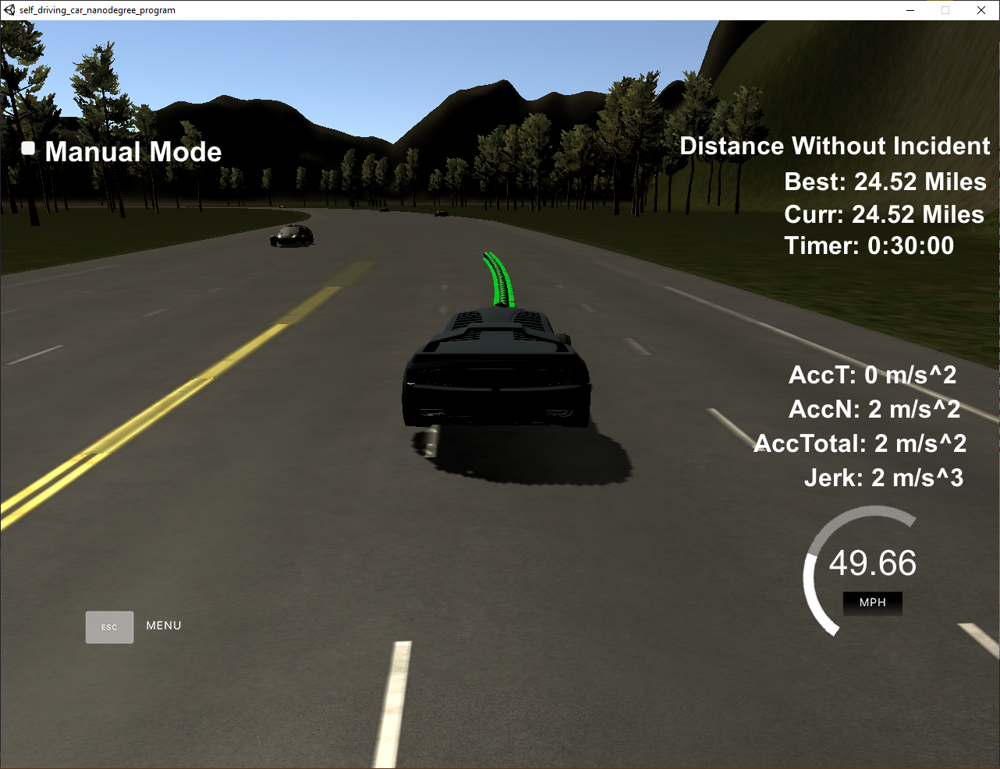

# CarND-Path-Planning-Project
Self-Driving Car Engineer Nanodegree Program
   
### Goals
In this project your goal is to safely navigate around a virtual highway with other traffic that is driving +-10 MPH of the 50 MPH speed limit. You will be provided the car's localization and sensor fusion data, there is also a sparse map list of waypoints around the highway. The car should try to go as close as possible to the 50 MPH speed limit, which means passing slower traffic when possible, note that other cars will try to change lanes too. The car should avoid hitting other cars at all cost as well as driving inside of the marked road lanes at all times, unless going from one lane to another. The car should be able to make one complete loop around the 6946m highway. Since the car is trying to go 50 MPH, it should take a little over 5 minutes to complete 1 loop. Also the car should not experience total acceleration over 10 m/s^2 and jerk that is greater than 10 m/s^3.

### Results
Here's a short gif about a random lane change.


I've measured the distance over 30 minutes to see the performance of the algorithm. With conservative paramters, only changing lane is there was a significant advantage, the [result](30min.png) was 20.71 miles.
After tweaking with lane score weights, the 30 minutes performance improved to 24.52 miles:



#### Fun facts
Distant cars can have very large velocity, for example:
```
car 4 at (161.37,2337.07) speed (-5.65,-45.85) lane 2 s 221.08 d 10.00 vs 46.18 vd -1.25
```
This car goes over 100 mph. Usually this is not a problem, however, I don't trust the other cars when cutting in front of them, and the 220 meter distance is less than 5 seconds away. This caused random aborted lane changes, where no cars could be seen nearby.
